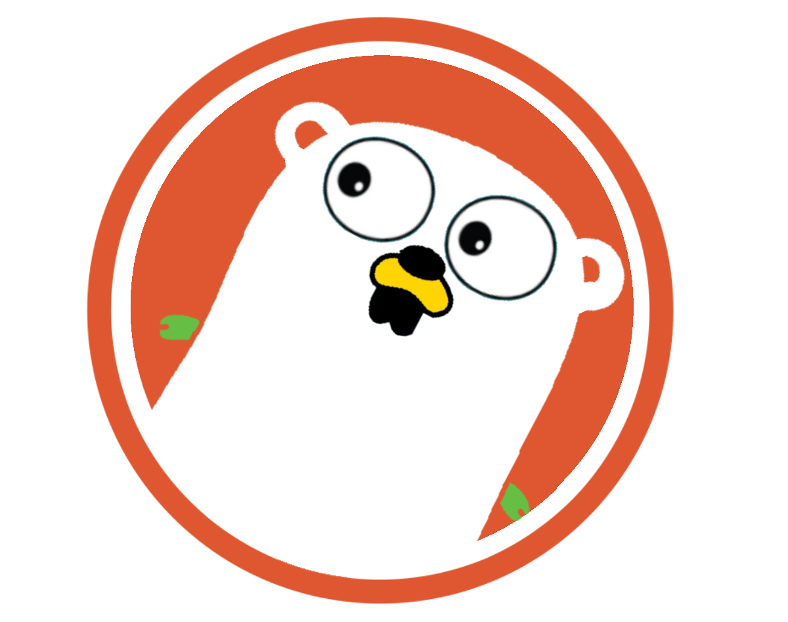

# 🪿 ZUK - DuckDuckGo CLI Search

[](https://github.com/zarazaex69/zuk/releases)
[](https://go.dev/)
[](LICENSE)

Fast and lightweight command-line interface for DuckDuckGo search. Built with Go and Bubble Tea for a smooth terminal experience, have sdk - see [Links](#links).

<p align="center">
  
</p>

# Quick Start

## 🌼  Install

**Quick Install (Linux/macOS):**

```bash
curl -fsSL https://raw.githubusercontent.com/zarazaex69/zuk/refs/heads/master/install.sh | bash
```


## 🦆 Overview

ZUK provides a privacy-focused search experience directly in your terminal. No API keys, no tracking, just fast DuckDuckGo searches with an intuitive TUI interface, have sdk, See [Links](#links) for more information.

###  Key Features

- **Privacy First** - Uses DuckDuckGo Lite API
- **Interactive TUI** - Built with Bubble Tea and viewport
- **Fast & Lightweight** - Single binary, no dependencies
- **Browser Integration** - Open results in your default browser
- **Cross-Platform** - Linux, macOS, Windows support
- **Keyboard Navigation** - Vim-style keybindings
- **Customizable Themes** - 5 built-in color schemes
- **Responsive Design** - Adapts to terminal size with scrolling
- **SDK** - Programmatic access for integration into other Go applications

###  Technology Stack

- **Go 1.23** - High-performance and fast compilation
- **Bubble Tea** - Modern TUI framework
- **Bubbles** - Viewport component for scrolling
- **Lipgloss** - Terminal styling and colors
- **goquery** - HTML parsing for search results
- **Make** - Build automation

## 🦆 Usage

```bash
# Start ZUK
zuk

# Set theme
zuk -t nya
zuk --theme soft

# List available themes
zuk --list-themes
```

###  Keyboard Shortcuts

- **Type** - Enter search query
- **Enter** - Execute search / Open selected result in browser
- **↑/↓ or j/k** - Navigate through results
- **Backspace** - Return to search input
- **Esc or q** - Quit application

###  Themes

ZUK comes with 5 built-in themes:

- **default** - Vibrant colors (orange, cyan, yellow)
- **monochrome** - Black & white (typography focused)
- **black** - Pure black background with bright ANSI colors
- **soft** - Soft pastel tones
- **nya** - Pink, blue, and cream palette

Theme preference is saved in `~/.config/zuk/config.json`

## 🦆 Development

### Prerequisites

- Go 1.23+
- Make (optional)

### Build from Source

```bash
# Clone repository
git clone https://github.com/zarazaex69/zuk.git
cd zuk

# Download dependencies
make deps

# Build binary
make build

# Run
./bin/zuk
```

### Project Structure

```
zuk/
├── cmd/
│   └── zuk/          # CLI entry point
├── pkg/
│   └── zuk/          # Public API package
│       ├── client.go # DuckDuckGo client
│       ├── client_test.go
│       └── doc.go    # Package documentation
├── internal/
│   ├── app/          # Application initialization
│   ├── config/       # Configuration management
│   │   └── config.go # Theme persistence
│   ├── ui/           # Bubble Tea UI components
│   │   ├── model.go  # State management
│   │   ├── view.go   # Rendering logic
│   │   ├── update.go # Event handling
│   │   └── themes.go # Color schemes
│   └── search/       # DuckDuckGo search wrapper
│       ├── search.go # Internal wrapper
│       └── browser.go # Browser integration
├── examples/         # Usage examples
│   ├── simple/       # Basic usage
│   └── advanced/     # Advanced usage
├── assets/           # Resources (logo)
├── .github/
│   └── workflows/    # CI/CD pipelines
├── Makefile          # Build automation
└── go.mod            # Go dependencies
```

## 🦆 Make Commands

```bash
make help      # Show available commands
make build     # Build the binary
make install   # Install to /usr/local/bin
make clean     # Remove build artifacts
make test      # Run tests (includes theme tests)
make lint      # Run linters
make deps      # Download dependencies
make tidy      # Tidy go modules
```

## 🦆 Examples

```bash
# Search with default theme
zuk

# Search with monochrome theme (no colors)
zuk -t monochrome

# Search with soft pastel theme
zuk --theme soft

# Search with custom Nya theme
zuk -t nya

# View all available themes
zuk --list-themes
```

## 🦆 How It Works

ZUK uses DuckDuckGo's Lite interface to perform searches:

1. Sends POST request to `https://lite.duckduckgo.com/lite/`
2. Parses HTML response using goquery
3. Extracts search results (title, URL, snippet)
4. Renders in viewport with theme-based styling
5. Tracks cursor position with auto-scrolling
6. Opens selected URLs in default browser

### Configuration

Theme settings are stored in `~/.config/zuk/config.json`:

```json
{
  "theme": "nya"
}
```


## Author 

**zarazaex** - [GitHub](https://github.com/zarazaex69)

## Links

- GitHub: [github.com/zarazaex69/zuk](https://github.com/zarazaex69/zuk)
- Issues: [github.com/zarazaex69/zuk/issues](https://github.com/zarazaex69/zuk/issues)
- Releases: [github.com/zarazaex69/zuk/releases](https://github.com/zarazaex69/zuk/releases)
- Install Script: [install.sh](https://raw.githubusercontent.com/zarazaex69/zuk/main/install.sh)
- Sdk: [examples/README.md](https://github.com/zarazaex69/zuk/examples/README.md)

## License 🐤

BSD License - See LICENSE file for details

## Acknowledgments

- Powered by [DuckDuckGo](https://duckduckgo.com)
- Built with [Bubble Tea](https://github.com/charmbracelet/bubbletea)
- HTML parsing by [goquery](https://github.com/PuerkitoBio/goquery)
